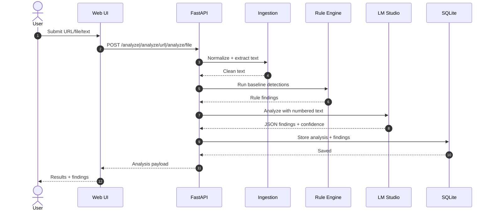
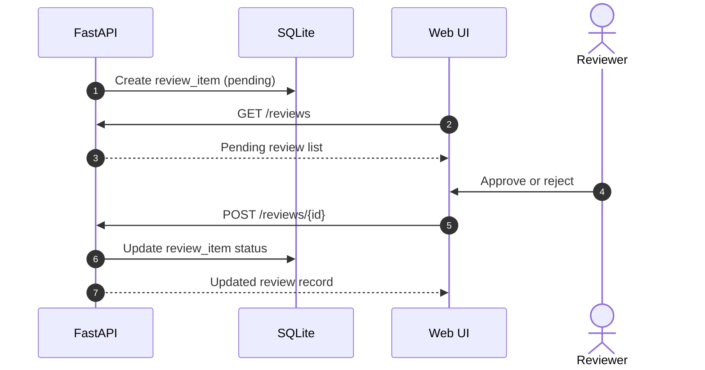
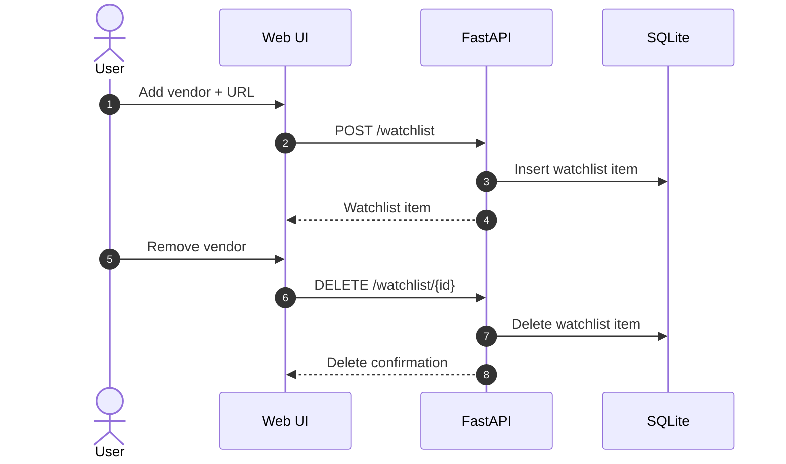

# Design Overview

## Goals and Scope
- Local-only analysis with LM Studio on the LAN.
- Jurisdictions: US-CA (CCPA/CPRA) and GDPR.
- Human-in-the-loop review for confidence < 0.80.

## Architecture
- `src/webapp/`: static UI (HTML/CSS/JS) served via local HTTP server.
- `src/backend/`: FastAPI backend for ingestion, analysis, and storage.
- LM Studio: OpenAI-compatible endpoint at `LM_STUDIO_BASE_URL` (default `http://192.168.1.7:1234/v1`).
- Local data: SQLite at `data/terms_analysis.db` (gitignored).

## Data Flow
1. User submits URL, file, or pasted text in the UI.
2. FastAPI ingests and normalizes the document (HTML/PDF/DOCX/RTF/TXT).
3. Rule-based detections run for baseline signals.
4. LLM analysis runs via LM Studio with line-numbered context.
5. Results are merged, validated, and scored for confidence.
6. If confidence < 0.80, a review item is created.
7. Analysis results are stored and surfaced in the UI.

## Storage
- `analyses`: analysis payload, confidence, score, grade, metadata, raw document text, and line offsets.
- `review_items`: HITL queue for low-confidence results.
- `watchlist_items`: vendors tracked locally, last policy text, and change summaries.

## Key Endpoints
- `POST /analyze`, `POST /analyze/url`, `POST /analyze/file`
- `GET /analyses`, `GET /analyses/{id}`
- `GET /reviews`, `POST /reviews/{id}`
- `GET/POST/DELETE /watchlist`, `POST /watchlist/{id}/refresh`
- `GET /exports/analysis/{id}`, `GET /exports/analysis/{id}.pdf`, `GET /exports/analyses.csv`

## API Contract (Selected)
### Analyze Text
Request:
```json
{
  "text": "Full policy text...",
  "name": "Acme Privacy Policy",
  "doc_type": "Privacy Policy",
  "jurisdictions": ["US-CA", "GDPR"]
}
```
Response:
```json
{
  "id": "uuid",
  "status": "completed",
  "review_required": false,
  "confidence": 0.91,
  "risk_score": 6.8,
  "grade": "C+",
  "created_at": "2025-09-08T12:34:56Z",
  "findings": [
    {
      "category": "Sale/Share",
      "severity": "High",
      "confidence": 0.86,
      "excerpt": "We may share personal information...",
      "explanation": "May trigger opt-out rights under CCPA/CPRA.",
      "jurisdictions": ["US-CA"],
      "evidence": { "line_start": 120, "line_end": 126, "legal_basis": ["CCPA/CPRA opt-out (Sale/Share)"] }
    }
  ]
}
```

### Analyze URL
Request:
```json
{ "url": "https://example.com/privacy", "jurisdictions": ["US-CA", "GDPR"] }
```

### Analyze File
`multipart/form-data` with `file`, optional `name`, `doc_type`, and `jurisdictions` (comma-separated).

### List Analyses
Response: array of summaries (`id`, `name`, `status`, `confidence`, `risk_score`, `grade`, `created_at`).

## Sequence Flow and Failure Modes
1. UI submits input to FastAPI.
2. Backend ingests and normalizes text.
3. Rule-based scan runs.
4. LM Studio is called with numbered text and rules context.
5. Results are validated and stored.
6. If confidence < 0.80, a review item is created.
7. UI refreshes dashboard, analysis, and watchlist views.

Failure modes:
- **LM Studio unreachable/invalid response**: fallback to rule-only findings; confidence lowered; may trigger review.
- **Parsing error/empty text**: return 400 with message; user must re-submit.
- **Invalid LLM JSON**: fallback to rule-only findings; confidence lowered.

## Mermaid Sequence Diagrams
### Analyze Document (URL/File/Text)

Step key:
1. User submits document input in the UI.
2. UI sends analysis request to FastAPI.
3. Backend runs ingestion/parsing.
4. Parsed text returned to API.
5. Rule engine runs baseline detections.
6. Rule findings returned to API.
7. API sends numbered text to LM Studio.
8. LM Studio returns structured findings.
9. API writes analysis to SQLite.
10. DB confirms write.
11. API returns analysis payload to UI.
12. UI renders results for the user.

### Human-in-the-Loop Review (Confidence < 0.80)

Step key:
1. API creates a pending review item.
2. UI fetches the review queue.
3. API returns pending items.
4. Reviewer selects approve/reject.
5. UI posts the review decision.
6. API updates the review item.
7. API returns updated review data.

### Watchlist Add and Remove

Step key:
1. User starts adding a vendor.
2. UI posts the watchlist create request.
3. API inserts the watchlist item in SQLite.
4. API returns the created item.
5. User requests removal.
6. UI deletes the watchlist item.
7. API deletes from SQLite.
8. API confirms deletion.

## Configuration
- `LM_STUDIO_BASE_URL`, `LM_STUDIO_MODEL`
- `DATABASE_URL`
- `REVIEW_THRESHOLD` (default 0.80)
- `ALLOWED_ORIGINS` (CORS)
- `WATCHLIST_REFRESH_SECONDS` (0 disables background refresh)

## Operational Notes
- OCR fallback requires `pytesseract` plus the local Tesseract binary.
- Watchlist refresh runs on a background loop when `WATCHLIST_REFRESH_SECONDS` > 0.
- LM Studio failures fall back to rule-only findings with reduced confidence.
