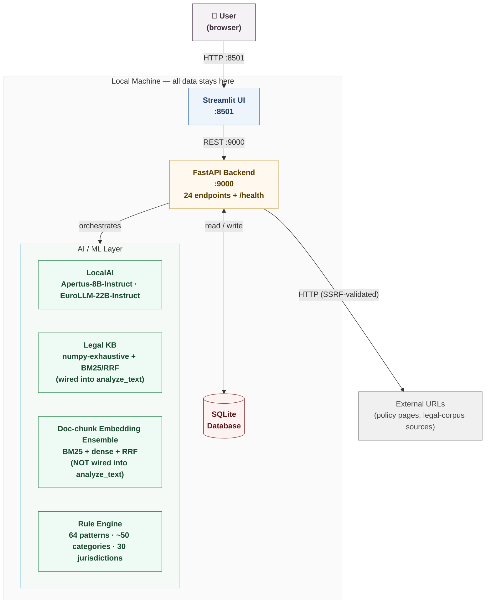
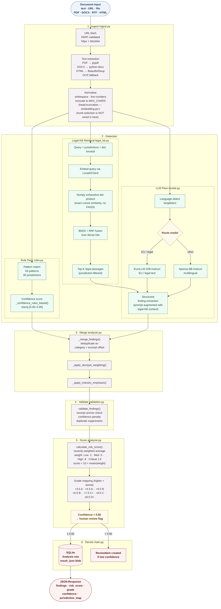
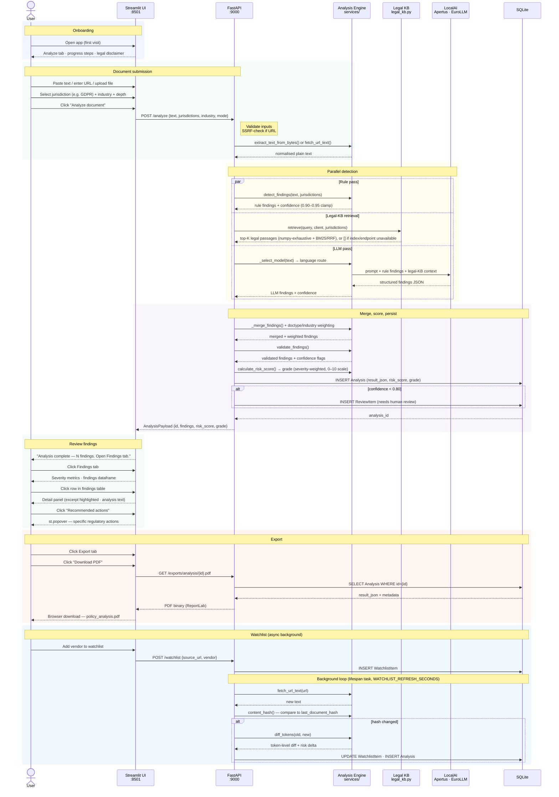

# System Architecture & Flow Diagrams

---

## L1 — System Context

High-level boundary view. What the system is, who uses it, and what it talks to.

---

## L2 — Component Architecture

Service-level view. Every module, its responsibilities, and how data moves between them.

```mermaid
graph TB
    classDef tab      fill:#eef4fb,stroke:#4a7fb5,color:#1e3a5f
    classDef endpoint fill:#fff8ee,stroke:#c49a3c,color:#5a3e00
    classDef svc      fill:#f5f2f5,stroke:#5e4c5f,color:#3d2e3e
    classDef ai       fill:#eefaf4,stroke:#3a8c5c,color:#1a4a30
    classDef model    fill:#e8f4e8,stroke:#5a9c5a,color:#1a3a1a
    classDef db       fill:#fdf2f2,stroke:#8b3a3a,color:#5a1a1a
    classDef dead     fill:#f5f5f5,stroke:#aaa,color:#666,stroke-dasharray: 5 5

    subgraph FE1 ["Streamlit UI  :8501"]
        TA["Analyze tab"]:::tab
        TF["Findings tab"]:::tab
        TC["Compare tab"]:::tab
        TE["Export tab"]:::tab
    end

    subgraph API ["FastAPI  :9000"]
        direction TB
        subgraph INGEST_EP ["Analyze endpoints"]
            EP1["POST /analyze"]:::endpoint
            EP2["POST /analyze/url"]:::endpoint
            EP3["POST /analyze/file"]:::endpoint
            EP4["POST /analyze/batch"]:::endpoint
        end
        subgraph RESULTS_EP ["Result endpoints"]
            EP5["GET /analyses"]:::endpoint
            EP6["GET /analyses/{id}"]:::endpoint
            EP7["GET /rubric"]:::endpoint
        end
        subgraph EXPORT_EP ["Export endpoints"]
            EP8["GET /exports/analysis/{id}.pdf"]:::endpoint
            EP9["GET /exports/analyses.csv"]:::endpoint
            EP10["GET /exports/analysis/{id}"]:::endpoint
        end
        subgraph WATCH_EP ["Watchlist / Snapshot / Policy-watch (12 endpoints)"]
            EP11["POST/GET /watchlist\nDELETE /watchlist/{id}\nPOST /watchlist/{id}/refresh"]:::endpoint
            EP13["GET/POST /snapshots\nGET /snapshots/detail/{id}"]:::endpoint
            EP14["GET /diff/{id1}/{id2}"]:::endpoint
            EP16["POST/GET /policy-watch\nDELETE /policy-watch/{id}\nPOST /policy-watch/{id}/snapshot"]:::endpoint
        end
        subgraph REVIEW_EP ["Human review"]
            EP15["GET /reviews"]:::endpoint
            EP17["POST /reviews/{id}"]:::endpoint
        end
        PERSIST["_persist_analysis()"]:::endpoint
    end

    subgraph SERVICES ["Services"]
        ING["ingest.py\nextract_text_from_bytes()\nfetch_url_text()\nSSRF blocklist"]:::svc
        ANA["analyzer.py  ← orchestrator\nanalyze_text()\n_merge_findings()\ncalculate_risk_score() — severity-weighted"]:::svc
        RUL["rules.py\ndetect_findings()\n64 patterns · ~50 categories · 30 jurisdictions\nconfidence clamp 0.90–0.95"]:::svc
        VAL["validation.py\nvalidate_findings()"]:::svc
        DIF["diffing.py\ncontent_hash()\ndiff_tokens()\ndiff_summary()"]:::svc
        LKB["legal_kb.py\nLegalKnowledgeBase\nbuild() / retrieve()\nnumpy-exhaustive + BM25/RRF"]:::svc
        EMB["embedding.py\nchunk_text() / bm25_scores() / rrf_fuse()\nselect_relevant_chunks() — NOT called by analyzer.py"]:::dead
        LOC["localai.py\nLocalAIClient\n_select_model() · embed()"]:::svc
    end

    subgraph AIMODELS ["AI Models — LocalAI"]
        EUR["EuroLLM-22B-Instruct\nEU / legal specialist\n35 languages"]:::model
        APE["Apertus-8B-Instruct\nWorld model\n1,000+ languages"]:::model
    end

    subgraph DBL ["SQLite — Data Layer"]
        T1[("Analysis\nid · document_text · result_json\nrisk_score · grade · status")]:::db
        T2[("ReviewItem\nanalysis_id · status · notes")]:::db
        T3[("WatchlistItem\nvendor · source_url\nlast_document_hash · last_analysis_id")]:::db
        T4[("PolicySnapshot\nurl · content_hash · raw_text")]:::db
        T5[("PolicyWatch\nurl · check_frequency")]:::db
    end

    subgraph CORPUS ["Legal Corpus (source)"]
        C1[("data/legal_corpus/&lt;jurisdiction&gt;/&lt;law&gt;.txt\ncurrently placeholder text —\nreal statutes pending (issue #6)")]:::db
    end

    %% Frontend → API
    TA -->|POST| EP1
    TA -->|POST| EP2
    TA -->|POST| EP3
    TF -->|GET| EP5
    TF -->|GET| EP6
    TE -->|GET| EP8
    TE -->|GET| EP9

    %% API → Services
    EP1 & EP2 & EP3 & EP4 --> ING
    ING --> ANA
    ANA --> RUL
    ANA --> LKB
    ANA --> LOC
    ANA --> VAL
    EP11 & EP13 --> DIF
    EP14 --> DIF

    %% Services → AI models
    LOC -->|"EU / legal text"| EUR
    LOC -->|"non-EU / multilingual"| APE
    LKB -->|"embed() calls"| LOC
    LKB -.->|"chunk_text / bm25_scores / rrf_fuse (shared helpers)"| EMB
    LKB -->|"reads at build time"| C1

    %% Persist
    ANA --> PERSIST
    PERSIST --> T1
    T1 -.->|FK| T2
    T3 -.->|last_analysis_id| T1
    T4 -.-> T5

    style FE1 fill:#f0f5fc,stroke:#c0d4f0
    style FE2 fill:#f0f5fc,stroke:#c0d4f0
    style API     fill:#fffcf0,stroke:#f0e0b0
    style SERVICES fill:#f8f5f8,stroke:#d0c0d0
    style AIMODELS fill:#f0faf4,stroke:#b0d8c0
    style DBL     fill:#fdf5f5,stroke:#f0c0c0
```

---

## Data Flow — Document to Findings

How a single document travels through the analysis pipeline.

---

## User Journey — Swim Lane

End-to-end journey across all actors from first visit to export, using the Streamlit UI.

---

*All components run locally. No data leaves the machine, except one-time legal-corpus ingestion from public government sources (offline, not part of the request-serving path). Architecture as of 2026-07-03 — reconciled against actual implementation (see issues #6/#7).*
